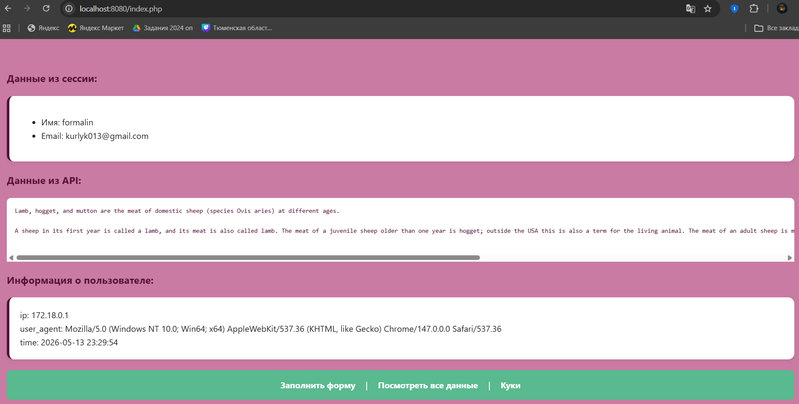

# Laboratory work №4: API
Learn how to retrieve and display data from a public API

## 💃 Author
Merkulova Elizaveta, AM-2

## 🍽️ Project content

```www/UserInfo``` — information about user

```www/ApiClient``` — class API

```www/process.php``` — PHP data processing

```www/cookies.php``` — cookie file

```www/index.php``` — PHP page

```www/form.html``` — registration form

```docker-compose.yml``` — Nginx description

```nginx.conf``` — Nginx configuration

```screenshots/``` — all screenshots

## 📸 Screenshots


## 🎉 Result
Super Puper PHP page with cookies, API and user info!
